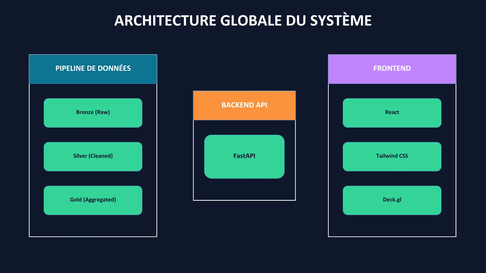

# Projet Data Architecture

## Schéma d'architecture global

Il y a trois blocs principaux dans notre architecture :

1. **Pipeline de données**

Elle suit une architecture en trois couches afin de garantir la qualité, la traçabilité et la réutilisabilité des données.

- Bronze
  - Données bruts issues d'API ou de CSV
  - Aucune transformation appliquée
- Silver
  - Nettoyage des données :
    - suppression des valeurs manquantes
    - normalisation des formats (prix, dates)
    - géocodage / enrichissement géographique
  - Jointure entre les datasets
- Gold
  - Données prête pour la data visualisation
  - KPI calculés :
    - prix médian au m² par arrondissement
    - évolution temporelle
    - indicateurs d'accessibilité

2. **Backend API**

Le backend expose les données traitées via une API afin de servir le dashboard en temps réel.

- Rôle principal
  - Centralisation de l'accès aux données Gold
  - Filtrage par :
    - arrondissement
    - période
    - type de logement
- Pourquoi FastAPI
  - rapide
  - scalabilité simple
  - swagger créé automatiquement
  - compatible JSON

3. **Frontend (React + Tailwind + Deck.gl)**

Le frontend est une interface interactive de data visualisation permettant d’explorer les dynamiques immobilières de Paris.

- React
  - gestion dynamique des composants
  - navigation fluide entre les vues
- Tailwind CSS
  - design rapide et cohérent
  - interface responsive
- Deck.gl
  - Rendu cartographique performant
